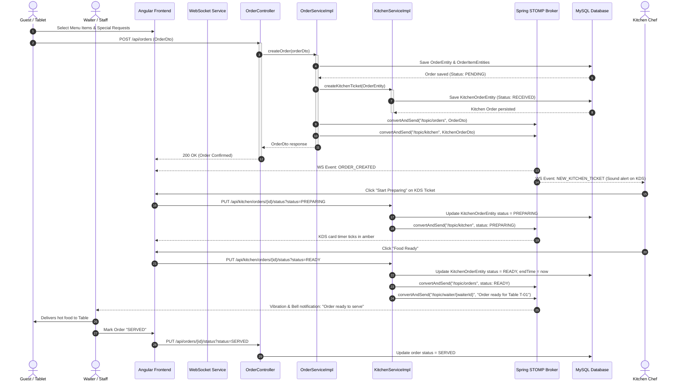
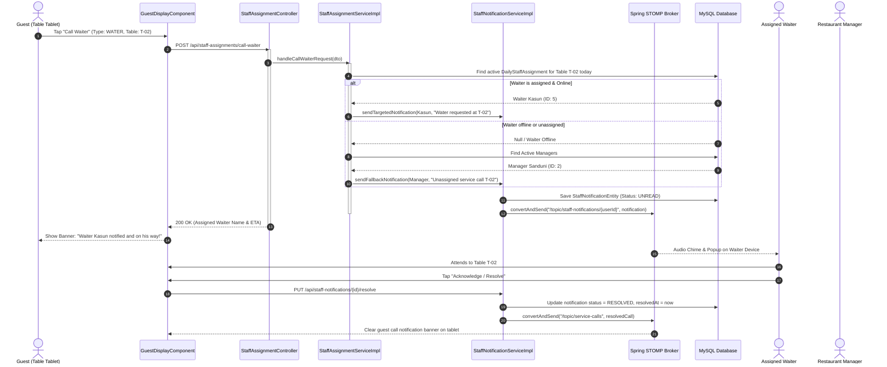
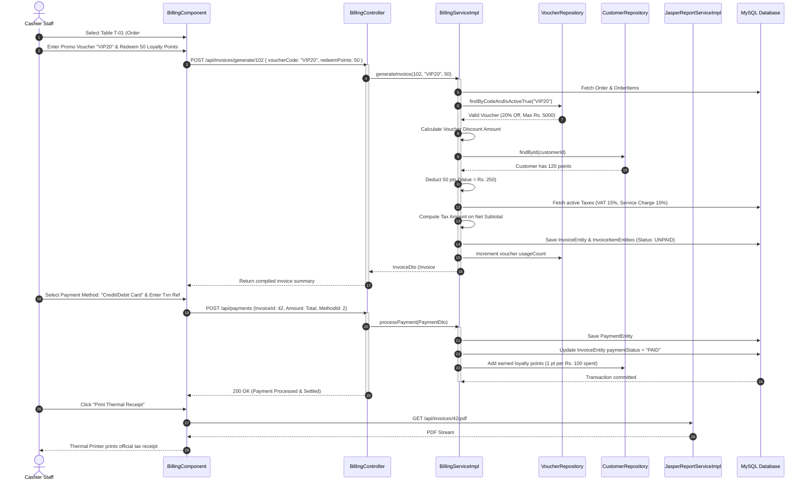
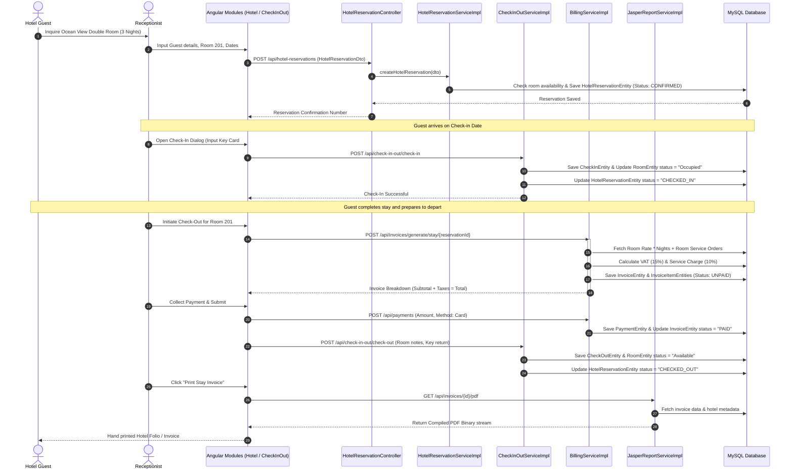
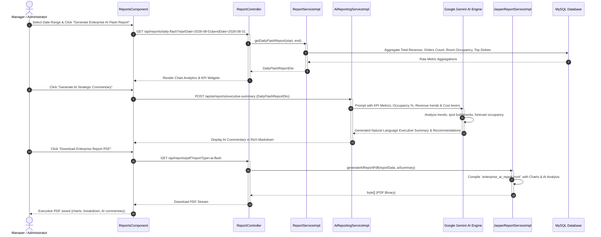

# Pol-Kole Resort & Restaurant Management System (RMS) OOAD Specification Document

---

## Document Metadata

| Attribute | Specification Details |
| :--- | :--- |
| **System Title** | Pol-Kole Resort & Restaurant Management System (RMS) |
| **Document Type** | Comprehensive OOAD Architectural & Design Specification |
| **Architecture Paradigm** | Multi-tier Object-Oriented Client-Server Architecture |
| **Frontend Framework** | Angular (v18/19), TypeScript, RxJS, StompJS, HTML5/CSS3 |
| **Backend Framework** | Spring Boot 3 (Java 21), Spring Security 6, Spring Data JPA |
| **Messaging & Real-time** | WebSocket with STOMP Broker (`/topic`, `/queue`, `/app`) |
| **Persistence Engine** | MySQL 8.0 Relational DBMS with Hibernate ORM |
| **Reporting & AI** | JasperReports 6.21 Engine & Spring AI (GROQ API) |

---

## Table of Contents

1. [Executive Summary & System Objectives](#1-executive-summary--system-objectives)
2. [Architectural Style & Design Patterns](#2-architectural-style--design-patterns)
3. [Actor Catalog & Role Hierarchy](#3-actor-catalog--role-hierarchy)
4. [Use Case Analysis & Model](#4-use-case-analysis--model)
   - 4.1. [Use Case Diagram](#41-use-case-diagram)
   - 4.2. [Subsystem Breakdown & Traceability](#42-subsystem-breakdown--traceability)
   - 4.3. [Core Use Case Specifications](#43-core-use-case-specifications)
5. [Domain Class Model (Structural Design)](#5-domain-class-model-structural-design)
   - 5.1. [Class Diagram](#51-class-diagram)
   - 5.2. [Entity Classification by Domain Cluster](#52-entity-classification-by-domain-cluster)
   - 5.3. [Data Dictionary & Entity Relationship Descriptions](#53-data-dictionary--entity-relationship-descriptions)
6. [Dynamic Behavioral Modeling (Sequence Diagrams)](#6-dynamic-behavioral-modeling-sequence-diagrams)
   - 6.1. [Sequence Flow 1: Dine-In Order & Kitchen KDS Execution](#61-sequence-flow-1-dine-in-order--kitchen-kds-execution)
   - 6.2. [Sequence Flow 2: Call-Waiter & Smart Staff Assignment](#62-sequence-flow-2-call-waiter--smart-staff-assignment)
   - 6.3. [Sequence Flow 3: Order Settlement, Voucher & Loyalty Points](#63-sequence-flow-3-order-settlement-voucher--loyalty-points)
   - 6.4. [Sequence Flow 4: Hotel Room Booking & Check-In / Out](#64-sequence-flow-4-hotel-room-booking--check-in--out)
   - 6.5. [Sequence Flow 5: Gemini AI Enterprise Analytical Reporting](#65-sequence-flow-5-gemini-ai-enterprise-analytical-reporting)
7. [OOAD Requirements Traceability Matrix](#7-ooad-requirements-traceability-matrix)
8. [Draw.io Diagram Visual Cross-References](#8-drawio-diagram-visual-cross-references)

---

## 1. Executive Summary & System Objectives

The **Pol-Kole Resort & Restaurant Management System (RMS)** is an enterprise-grade hospitality software platform built to unify hotel lodging operations, multi-zone restaurant dining, real-time Kitchen Display Systems (KDS), interactive customer kiosk tablets, point-of-sale invoicing, and executive business intelligence.

### Key Functional Objectives
- **Omnichannel Ordering**: Seamless coordination across dine-in tables, hotel room service, and takeaway counters.
- **Real-Time Kitchen Display System (KDS)**: Sub-second synchronization between front-of-house staff, kitchen stations (Chef), and guest tablets via WebSockets.
- **Smart Staff Dispatching**: Intelligent dynamic routing of customer service requests (water, cutlery, assistance) to assigned on-duty waiters with automatic duty manager fallback.
- **Integrated Folio & POS Billing**: Unified billing supporting time-windowed item discounts, coupon vouchers, customer loyalty points, dual tax breakdown (VAT + Service Charge), and JasperReports PDF generation.
- **Enterprise AI Reporting**: Integration with Google Gemini via Spring AI to convert raw metrics (occupancy rates, cover counts, preparation times) into natural language executive strategy reports.

---

## 2. Architectural Style & Design Patterns

The system applies standard Object-Oriented Analysis and Design (OOAD) principles and enterprise design patterns:

```
+-------------------------------------------------------------------------+
|                         PRESENTATION LAYER                              |
|   Angular 18/19 SPA Modules | RxJS Reactive Stores | StompJS Client    |
+------------------------------------+------------------------------------+
                                     | (REST API / WebSocket)
+------------------------------------v------------------------------------+
|                          APPLICATION GATEWAY                            |
|       Spring Security 6 | JwtAuthenticationFilter | CORS Configuration  |
+------------------------------------+------------------------------------+
                                     |
+------------------------------------v------------------------------------+
|                         BUSINESS SERVICE LAYER                          |
|  Controllers (REST endpoints) <-> Services (Transactional Business Logic) |
+------------------+------------------------------------+-----------------+
                   |                                    |
+------------------v---------------+   +----------------v-----------------+
|     PERSISTENCE LAYER (JPA)      |   |       REAL-TIME EVENT BROKER     |
| Spring Data JPA Repositories     |   | Spring SimpleBrokerMessageBroker |
| Hibernate ORM | MySQL 8.0 Engine |   | STOMP Over WebSocket (/topic)   |
+----------------------------------+   +----------------------------------+
```

### Applied Object-Oriented Design Patterns

1. **Controller-Service-Repository (Layered Architecture Pattern)**:
   - *Separation of Concerns*: Presentation logic is isolated in Controllers (`OrderController`), business rules in Service Interfaces (`OrderService`, `OrderServiceImpl`), and database queries in Repositories (`OrderRepository`).
2. **Data Transfer Object (DTO) Pattern**:
   - Decouples client payload contracts (`OrderDto`, `InvoiceDto`, `StaffNotificationDto`) from persistent JPA entities, preventing over-fetching and protecting internal database schemas.
3. **Observer / Publish-Subscribe Pattern**:
   - Implemented via Spring WebSocket Message Broker (`@EnableWebSocketMessageBroker`). Services publish domain events to `/topic/orders` and `/topic/kitchen`, automatically notifying subscribed client components (Angular KDS, Waiter tablets).
4. **Strategy Pattern**:
   - Encapsulated in the billing sub-system for multiple discount types (`PERCENTAGE`, `FIXED_OFF`, `SPECIAL_PRICE`) and payment processing strategies (`CASH`, `CARD`, `LANKAQR`).
5. **Builder & Factory Pattern**:
   - Utilized through Lombok `@Builder` annotations across all JPA entities and DTOs to ensure immutable and readable object instantiation.
6. **Interceptor & Auditing Listener Pattern**:
   - `JwtAuthenticationFilter` intercepts HTTP requests for stateless token validation.
   - Spring Data JPA `AuditingEntityListener` automatically populates `@CreatedDate`, `@LastModifiedDate`, `@CreatedBy`, and `@LastModifiedBy` fields across database entities.

---

## 3. Actor Catalog & Role Hierarchy

| Actor Name | Type | Scope of Responsibilities |
| :--- | :--- | :--- |
| **Administrator (`ADMIN`)** | Human / Internal | Complete operational and configuration authority: user/role provisioning, system settings, table/room configuration, audit inspection, and financial analytics. |
| **Manager (`MANAGER`)** | Human / Internal | Shift assignments, staff attendance monitoring, menu pricing, discount/voucher configuration, report generation, and handling unassigned service fallbacks. |
| **Receptionist (`RECEPTIONIST`)** | Human / Internal | Front desk lodging operations: room availability checks, hotel bookings, check-in, key-card issuance, room checkout, and customer profiles. |
| **Waiter (`WAITER`)** | Human / Internal | Table attendance, order placement, food delivery, table check-in, and receiving real-time guest service calls. |
| **Chef (`CHEF`)** | Human / Internal | Kitchen operations: KDS ticket monitoring, updating cooking phases (`RECEIVED` $\rightarrow$ `PREPARING` $\rightarrow$ `READY`), and station workload balancing. |
| **Cashier (`CASHIER`)** | Human / Internal | Order checkout, voucher verification, customer loyalty redemption, invoice compilation, payment settlement, and printing fiscal receipts. |
| **Guest / Customer** | Human / External | Unauthenticated or kiosk/tablet user: viewing digital menu, placing self-orders, calling service staff, and tracking takeaway status. |
| **AI Engine (Gemini)** | Automated / External | AI analytical processor: executes algorithmic tools, diagnoses hospitality performance anomalies, and generates natural language recommendations. |

---

## 4. Use Case Analysis & Model

### 4.1. Use Case Diagram

```mermaid
flowchart TB
    %% Actors
    subgraph Actors [System Actors]
        direction TB
        Admin["Administrator"]
        Manager["Manager"]
        Receptionist["Receptionist / Front Desk"]
        Waiter["Waiter / Service Staff"]
        Chef["Chef / Kitchen Staff"]
        Cashier["Cashier"]
        Guest["Guest / Customer (Tablet / Kiosk)"]
        AiEngine["AI Engine (Gemini / Spring AI)"]
    end

    %% Subsystems
    subgraph AuthSubsystem ["1. Identity, Access & Audit"]
        UC_Login(["Authenticate / Login (JWT)"])
        UC_ManageUsers(["Manage Users & Statuses"])
        UC_ManageRoles(["Manage Roles & Permissions"])
        UC_ViewAudit(["Inspect Audit Logs"])
    end

    subgraph HotelSubsystem ["2. Hotel & Lodging Management"]
        UC_ManageRooms(["Manage Rooms & Types"])
        UC_BookRoom(["Book Hotel Reservation"])
        UC_CheckInGuest(["Process Hotel Check-In"])
        UC_CheckOutGuest(["Process Hotel Check-Out"])
    end

    subgraph DiningSubsystem ["3. Dining & Table Management"]
        UC_ManageTables(["Manage Tables & Locations"])
        UC_BookTable(["Reserve Dining Table"])
        UC_TableCheckIn(["Process Table Check-In / Out"])
    end

    subgraph CatalogSubsystem ["4. Menu & Pricing Catalog"]
        UC_ManageMenu(["Manage Menu Categories & Items"])
        UC_ConfigureDiscounts(["Configure Item Discounts & Promos"])
        UC_ManageVouchers(["Configure Voucher Coupons"])
    end

    subgraph OrderSubsystem ["5. Order Processing & Guest Interactions"]
        UC_PlaceOrder(["Place Order (Dine-in / Room / Takeaway)"])
        UC_CallWaiter(["Call Waiter / Service Assistance"])
        UC_TrackTakeaway(["Track Order on Public Display Screen"])
        UC_RequestBill(["Request Table / Room Bill"])
    end

    subgraph KitchenSubsystem ["6. Kitchen Display System (KDS)"]
        UC_ViewKDS(["Monitor Live Kitchen Tickets"])
        UC_UpdateKitchenStatus(["Update Food Prep Status (Prep/Ready/Delivered)"])
        UC_AssignChefStation(["Assign Chef to Station"])
    end

    subgraph BillingSubsystem ["7. Billing, Invoicing & Settlement"]
        UC_GenerateInvoice(["Generate & Compile Invoice"])
        UC_ApplyDiscountVoucher(["Apply Voucher / Loyalty Points"])
        UC_ProcessPayment(["Process Payment (Cash, Card, LankaQR)"])
        UC_PrintReceipt(["Print Jasper PDF Invoice / Bill"])
    end

    subgraph StaffSubsystem ["8. Staff Operations & Presence"]
        UC_ShiftAssignment(["Daily Shift Assignment (Waiters & Chefs)"])
        UC_TrackAttendance(["Mark & Track Attendance / Presence"])
        UC_HandleNotifications(["Receive & Resolve Staff Push Notifications"])
    end

    subgraph ReportSubsystem ["9. Business Intelligence & AI Reporting"]
        UC_ViewDailyFlash(["View Daily Flash & Financial KPIs"])
        UC_ExportJasper(["Generate PDF Jasper Reports"])
        UC_RunAiInsights(["Generate Gemini AI Predictive Insights"])
    end

    %% Actor Relationships -> Subsystems
    Admin --> UC_ManageUsers
    Admin --> UC_ManageRoles
    Admin --> UC_ViewAudit
    Admin --> UC_ManageRooms
    Admin --> UC_ManageTables
    Admin --> UC_ManageMenu
    Admin --> UC_ConfigureDiscounts
    Admin --> UC_ManageVouchers
    Admin --> UC_ViewDailyFlash
    Admin --> UC_ExportJasper
    Admin --> UC_RunAiInsights

    Manager --> UC_ShiftAssignment
    Manager --> UC_TrackAttendance
    Manager --> UC_ManageMenu
    Manager --> UC_ConfigureDiscounts
    Manager --> UC_ManageVouchers
    Manager --> UC_ViewDailyFlash
    Manager --> UC_ExportJasper
    Manager --> UC_RunAiInsights

    Receptionist --> UC_BookRoom
    Receptionist --> UC_CheckInGuest
    Receptionist --> UC_CheckOutGuest
    Receptionist --> UC_BookTable
    Receptionist --> UC_TableCheckIn

    Waiter --> UC_PlaceOrder
    Waiter --> UC_HandleNotifications
    Waiter --> UC_TrackAttendance
    Waiter --> UC_TableCheckIn

    Chef --> UC_ViewKDS
    Chef --> UC_UpdateKitchenStatus
    Chef --> UC_TrackAttendance

    Cashier --> UC_GenerateInvoice
    Cashier --> UC_ApplyDiscountVoucher
    Cashier --> UC_ProcessPayment
    Cashier --> UC_PrintReceipt

    Guest --> UC_PlaceOrder
    Guest --> UC_CallWaiter
    Guest --> UC_RequestBill
    Guest --> UC_TrackTakeaway

    AiEngine --> UC_RunAiInsights

    %% Common Inclusions
    UC_BookRoom -.->|<<include>>| UC_Login
    UC_ManageUsers -.->|<<include>>| UC_Login
    UC_GenerateInvoice -.->|<<include>>| UC_Login
    UC_CheckInGuest -.->|<<include>>| UC_Login
    UC_ViewKDS -.->|<<include>>| UC_Login

    %% Extends
    UC_ApplyDiscountVoucher -.->|<<extend>>| UC_GenerateInvoice
    UC_PrintReceipt -.->|<<extend>>| UC_ProcessPayment
    UC_UpdateKitchenStatus -.->|<<extend>>| UC_ViewKDS
    UC_CallWaiter -.->|<<extend>>| UC_HandleNotifications
```



---

### 4.2. Subsystem Breakdown & Traceability

1. **Identity, Access & Audit Subsystem**:
   - `UC-01`: Authenticate & Issue JWT Token (`/api/user/login`).
   - `UC-02`: Role-Based Access Control configuration (`/api/user/**`, `/api/list/**`).
   - `UC-03`: Persistent Audit Logging for compliance (`/api/audit-logs/**`).
2. **Hotel & Lodging Subsystem**:
   - `UC-04`: Room Inventory & Room Type Amenities (`/api/rooms/**`).
   - `UC-05`: Reservation Scheduling & Date Conflict Checking (`/api/hotel-reservations/**`).
   - `UC-06`: Room Check-In with Key Card Issuance (`/api/check-in-out/check-in`).
   - `UC-07`: Room Check-Out with Stay Invoicing (`/api/check-in-out/check-out`).
3. **Dining & Table Subsystem**:
   - `UC-08`: Table Floor Plan & Location Mapping (`/api/tables/**`, `/api/table-locations/**`).
   - `UC-09`: Table Booking Management (`/api/reservations/**`).
   - `UC-10`: Table Check-In & Seating Status Transitions (`/api/check-in-out/table-check-in/**`).
4. **Menu & Pricing Catalog Subsystem**:
   - `UC-11`: Menu Category & Item CRUD (`/api/menu/**`).
   - `UC-12`: Time-Window Item Discounts (`/api/item-discounts/**`).
   - `UC-13`: Promotional Voucher Coupons (`/api/vouchers/**`).
5. **Order Processing & Kiosk Subsystem**:
   - `UC-14`: Multi-Channel Order Creation (Table / Room / Takeaway) (`/api/orders/**`).
   - `UC-15`: Guest Interactive Table / Room Tablet Service Calling (`/api/staff-assignments/call-waiter`).
   - `UC-16`: Public Kiosk Takeaway Order Tracking (`/display/takeaway`).
6. **Kitchen Display System (KDS)**:
   - `UC-17`: Live Kitchen Ticket Streaming via WebSockets (`/api/kitchen/orders/**`).
   - `UC-18`: Real-time Culinary Stage Tracking (`RECEIVED` $\rightarrow$ `PREPARING` $\rightarrow$ `READY` $\rightarrow$ `SERVED`).
7. **Billing & Settlement Subsystem**:
   - `UC-19`: Invoice Calculation with dynamic discounts and tax levies (`/api/invoices/**`).
   - `UC-20`: Multi-Channel Payment Settlement (`/api/payments`).
   - `UC-21`: JasperReports High-Resolution PDF Receipt Rendering (`/api/invoices/{id}/pdf`).
8. **Staff Operations & Presence Subsystem**:
   - `UC-22`: Automated & Custom Shift Scheduling (`/api/staff-assignments/**`).
   - `UC-23`: Real-time Attendance & Online Presence Tracking (`/api/attendance/**`, `/api/presence/**`).
   - `UC-24`: Targeted Staff Push Notifications with Manager Escalation (`/api/staff-notifications/**`).
9. **Business Intelligence & AI Analytics**:
   - `UC-25`: Real-time Daily Flash KPIs & Sales Metrics (`/api/reports/daily-flash`).
   - `UC-26`: Automated JasperReports Report PDF Export (`/api/reports/pdf`).
   - `UC-27`: Google Gemini Natural Language Strategic Diagnostics (`/api/ai/reports/**`).

---

### 4.3. Core Use Case Specifications

#### Use Case: `UC-14 Place Customer Order`
- **Primary Actor**: Waiter / Guest (Tablet).
- **Preconditions**: Customer is seated at an active table or registered to an occupied hotel room.
- **Main Success Scenario**:
  1. Actor browses menu categories and selects items with quantities and special cooking notes.
  2. Frontend verifies item availability and submits `OrderDto` via `POST /api/orders`.
  3. `OrderService` persists `OrderEntity` and cascades child `OrderItemEntity` records.
  4. `OrderService` triggers `KitchenService` to initialize a `KitchenOrderEntity` ticket.
  5. STOMP Broker broadcasts the order event to `/topic/orders` and `/topic/kitchen`.
  6. Kitchen display chimes and updates in real-time.
- **Extensions**:
  - *3a. Item out of stock*: System aborts transaction and returns error message.

#### Use Case: `UC-19 Generate & Settle Order Invoice`
- **Primary Actor**: Cashier.
- **Preconditions**: Order status is `READY` or `SERVED`.
- **Main Success Scenario**:
  1. Cashier enters table number or order ID.
  2. Cashier inputs optional promo voucher code and customer loyalty point deduction.
  3. `BillingService` verifies voucher validity, computes discounts, and applies VAT and service charge.
  4. Cashier submits payment (Cash/Card/LankaQR).
  5. System records `PaymentEntity`, sets invoice status to `PAID`, awards earned loyalty points, and prints thermal tax receipt.

---

## 5. Domain Class Model (Structural Design)

### 5.1. Class Diagram

```mermaid
classDiagram
    direction TB

    %% ================= IDENTITY & SECURITY =================
    class UserEntity {
        +Integer id
        +String name
        +String email
        +String password
        +String phone
        +String onlineStatus
        +Instant lastSeen
        +Instant createdAt
        +Instant updatedAt
        +onCreate()
        +onUpdate()
    }

    class UserroleEntity {
        +Integer id
        +String name
    }

    class UserstatusEntity {
        +Integer id
        +String name
    }

    class PermissionEntity {
        +Integer id
        +String name
        +String description
    }

    class AuditLogEntity {
        +Integer id
        +String action
        +String details
        +String performedBy
        +Instant timestamp
    }

    UserEntity "1" --> "1" UserroleEntity : role
    UserEntity "1" --> "1" UserstatusEntity : status
    UserroleEntity "*" <--> "*" PermissionEntity : role_permissions
    UserEntity "1" --> "*" AuditLogEntity : logs

    %% ================= HOTEL & LODGING =================
    class RoomTypeEntity {
        +Integer id
        +String name
        +String description
        +BigDecimal defaultPrice
        +Integer maxCapacity
        +String amenities
    }

    class RoomEntity {
        +Integer id
        +String roomNumber
        +Integer capacity
        +String status
        +boolean isDeleted
    }

    class HotelReservationEntity {
        +Integer id
        +LocalDate checkInDate
        +LocalDate checkOutDate
        +Integer guestsCount
        +String status
        +Instant createdAt
        +Instant updatedAt
        +String createdBy
        +String updatedBy
        +boolean isDeleted
    }

    class CheckInEntity {
        +Integer id
        +Instant checkInTime
        +String initialRoomConditionNotes
        +String keyCardNumber
        +String createdBy
    }

    class CheckOutEntity {
        +Integer id
        +Instant checkOutTime
        +String roomConditionOnExit
        +BigDecimal additionalCharges
        +String createdBy
    }

    RoomEntity "1" --> "1" RoomTypeEntity : roomType
    HotelReservationEntity "*" --> "1" RoomEntity : room
    HotelReservationEntity "*" --> "1" CustomerEntity : customer
    CheckInEntity "1" --> "1" HotelReservationEntity : reservation
    CheckOutEntity "1" --> "1" HotelReservationEntity : reservation

    %% ================= DINING & RESTAURANT =================
    class TableLocationEntity {
        +Integer id
        +String name
        +String description
    }

    class RestaurantTableEntity {
        +Integer id
        +String tableNumber
        +Integer capacity
        +String status
        +boolean isAvailableForReservation
        +boolean isDeleted
    }

    class ReservationStatusEntity {
        +Integer id
        +String statusName
        +String description
    }

    class ReservationEntity {
        +Integer id
        +LocalDate reservationDate
        +String reservationTime
        +Integer guestsCount
        +String specialRequests
        +Instant createdAt
        +Instant updatedAt
        +String createdBy
        +String updatedBy
        +boolean isDeleted
    }

    RestaurantTableEntity "*" --> "1" TableLocationEntity : location
    ReservationEntity "*" --> "1" RestaurantTableEntity : table
    ReservationEntity "*" --> "1" CustomerEntity : customer
    ReservationEntity "*" --> "1" ReservationStatusEntity : reservationStatus

    %% ================= MENU & CATALOG =================
    class MenuCategoryEntity {
        +Integer id
        +String name
        +String description
        +boolean isDeleted
    }

    class MenuItemEntity {
        +Integer id
        +String name
        +String description
        +BigDecimal price
        +Integer preparationTime
        +boolean isAvailable
        +boolean isDeleted
    }

    class ItemDiscountEntity {
        +Integer id
        +String title
        +String discountType
        +BigDecimal discountValue
        +LocalDate startDate
        +LocalDate endDate
        +boolean isActive
        +boolean isDeleted
    }

    class VoucherEntity {
        +Integer id
        +String code
        +String description
        +String discountType
        +BigDecimal discountValue
        +BigDecimal minBillAmount
        +BigDecimal maxDiscountAmount
        +LocalDate activeFrom
        +LocalDate activeTo
        +Integer usageLimit
        +int usageCount
        +boolean isActive
        +String applicableType
        +boolean isDeleted
    }

    class TaxEntity {
        +Integer id
        +String name
        +BigDecimal percentage
        +boolean active
    }

    MenuItemEntity "*" --> "1" MenuCategoryEntity : category
    ItemDiscountEntity "*" --> "1" MenuItemEntity : menuItem

    %% ================= ORDERS & KITCHEN =================
    class OrderEntity {
        +Integer id
        +Instant orderTime
        +BigDecimal totalAmount
        +String notes
        +boolean isDeleted
        +onCreate()
    }

    class OrderItemEntity {
        +Integer id
        +Integer quantity
        +BigDecimal unitPrice
        +BigDecimal subtotal
        +String specialInstructions
    }

    class OrderStatusEntity {
        +Integer id
        +String name
    }

    class KitchenOrderEntity {
        +Integer id
        +String station
        +String preparationStatus
        +Integer preparationTimer
        +Instant startTime
        +Instant endTime
        +onCreate()
    }

    OrderEntity "*" --> "0..1" CustomerEntity : customer
    OrderEntity "*" --> "0..1" RestaurantTableEntity : table
    OrderEntity "*" --> "0..1" RoomEntity : room
    OrderEntity "*" --> "0..1" UserEntity : assignedWaiter
    OrderEntity "*" --> "1" OrderStatusEntity : status
    OrderEntity "1" *-- "*" OrderItemEntity : items
    OrderItemEntity "*" --> "1" MenuItemEntity : menuItem
    KitchenOrderEntity "1" --> "1" OrderEntity : order
    KitchenOrderEntity "*" --> "0..1" UserEntity : assignedChef

    %% ================= BILLING & PAYMENTS =================
    class InvoiceEntity {
        +Integer id
        +String invoiceNumber
        +BigDecimal orderSubtotal
        +BigDecimal taxAmount
        +BigDecimal discountAmount
        +BigDecimal totalAmount
        +String paymentStatus
        +Instant createdAt
        +Instant updatedAt
        +String createdBy
    }

    class InvoiceItemEntity {
        +Integer id
        +String itemName
        +Integer quantity
        +BigDecimal unitPrice
        +BigDecimal totalPrice
    }

    class PaymentMethodEntity {
        +Integer id
        +String name
    }

    class PaymentEntity {
        +Integer id
        +BigDecimal amount
        +Instant paymentTime
        +String transactionReference
    }

    InvoiceEntity "0..1" --> "0..1" OrderEntity : order
    InvoiceEntity "*" --> "0..1" HotelReservationEntity : hotelReservation
    InvoiceEntity "*" --> "0..1" ReservationEntity : tableReservation
    InvoiceEntity "1" *-- "*" InvoiceItemEntity : items
    PaymentEntity "*" --> "1" InvoiceEntity : invoice
    PaymentEntity "*" --> "1" PaymentMethodEntity : paymentMethod

    %% ================= CUSTOMER & LOYALTY =================
    class CustomerEntity {
        +Integer id
        +String name
        +String email
        +String phone
        +String nicPassport
        +String nationality
        +String address
        +Integer loyaltyPoints
        +boolean isDeleted
    }

    class LoyaltyPointEntity {
        +Integer id
        +Integer pointsEarned
        +Integer pointsRedeemed
        +Instant transactionDate
    }

    LoyaltyPointEntity "*" --> "1" CustomerEntity : customer
    LoyaltyPointEntity "*" --> "0..1" InvoiceEntity : invoice

    %% ================= STAFF & ATTENDANCE =================
    class DailyStaffAssignmentEntity {
        +Long id
        +LocalDate assignmentDate
        +String roleType
        +String assignmentType
        +String zoneOrStation
        +boolean isActive
        +String notes
        +Instant createdAt
        +Instant updatedAt
    }

    class AttendanceEntity {
        +Long id
        +LocalDate workDate
        +Instant checkInTime
        +Instant checkOutTime
        +AttendanceStatus status
        +String remarks
    }

    class StaffNotificationEntity {
        +Long id
        +String type
        +String title
        +String message
        +String targetType
        +Integer targetId
        +String targetLabel
        +String priority
        +String status
        +boolean isFallback
        +String fallbackNote
        +Instant createdAt
        +Instant resolvedAt
    }

    DailyStaffAssignmentEntity "*" --> "1" UserEntity : user
    DailyStaffAssignmentEntity "*" --> "0..1" RestaurantTableEntity : table
    DailyStaffAssignmentEntity "*" --> "0..1" RoomEntity : room
    AttendanceEntity "*" --> "1" UserEntity : user
    StaffNotificationEntity "*" --> "1" UserEntity : recipient
    StaffNotificationEntity "*" --> "0..1" UserEntity : sender

    %% ================= SYSTEM CONFIGURATION =================
    class RestaurantSettingsEntity {
        +Integer id
        +String restaurantName
        +String address
        +String phone
        +String email
        +String currencySymbol
        +BigDecimal defaultTaxRate
        +BigDecimal defaultServiceChargeRate
        +String openingHours
        +String closingHours
    }
```



---

### 5.2. Entity Classification by Domain Cluster

| Domain Cluster | Entities Included | Responsibilities |
| :--- | :--- | :--- |
| **Security & Identity** | `UserEntity`, `UserroleEntity`, `UserstatusEntity`, `PermissionEntity`, `AuditLogEntity` | Authentication, RBAC credentials, session status, and audit logs. |
| **Hotel Lodging** | `RoomEntity`, `RoomTypeEntity`, `HotelReservationEntity`, `CheckInEntity`, `CheckOutEntity` | Room stock, pricing tiers, reservation windows, key-cards, and room conditions. |
| **Dining & Seating** | `RestaurantTableEntity`, `TableLocationEntity`, `ReservationEntity`, `ReservationStatusEntity` | Table capacities, dining areas, and table reservation workflows. |
| **Menu & Catalog** | `MenuCategoryEntity`, `MenuItemEntity`, `ItemDiscountEntity`, `VoucherEntity`, `TaxEntity` | Dishes, beverage catalog, promo vouchers, and tax policies. |
| **Orders & KDS** | `OrderEntity`, `OrderItemEntity`, `OrderStatusEntity`, `KitchenOrderEntity` | Order lifecycle, order item cascading, and chef cooking tickets. |
| **Invoicing & Payments** | `InvoiceEntity`, `InvoiceItemEntity`, `PaymentEntity`, `PaymentMethodEntity`, `LoyaltyPointEntity` | Compiled folios, itemized breakdowns, multi-tender payments, and loyalty points. |
| **Staff & Shift Ops** | `DailyStaffAssignmentEntity`, `AttendanceEntity`, `StaffNotificationEntity`, `RestaurantSettingsEntity` | Waiter/Chef zone schedules, attendance tracking, and service push notifications. |

---

## 6. Dynamic Behavioral Modeling (Sequence Diagrams)

### 6.1. Sequence Flow 1: Dine-In Order & Kitchen KDS Execution

Demonstrates the real-time order lifecycle: Guest/Waiter $\rightarrow$ REST $\rightarrow$ JPA $\rightarrow$ STOMP WebSockets $\rightarrow$ Kitchen Display System $\rightarrow$ Waiter Notification.



---

### 6.2. Sequence Flow 2: Call-Waiter & Smart Staff Assignment

Illustrates customer service calling (`WATER`, `CUTLERY`, `BILL`), targeted on-duty staff resolution, and automated escalation to Duty Managers.



---

### 6.3. Sequence Flow 3: Order Settlement, Voucher & Loyalty Points

Illustrates point-of-sale invoice compilation, coupon verification, loyalty redemption, tax calculation, and Jasper PDF printing.



---

### 6.4. Sequence Flow 4: Hotel Room Booking & Check-In / Out

Illustrates the lodging lifecycle: booking, check-in, key-card logging, room service charge accumulation, checkout, and stay folio export.



---

### 6.5. Sequence Flow 5: Gemini AI Enterprise Analytical Reporting

Illustrates multi-table metric aggregation, Google Gemini Spring AI integration, and JasperReports automated PDF synthesis.



---

## 7. OOAD Requirements Traceability Matrix

| Use Case ID | Primary Entities Involved | Controller & Service Endpoints | UI Component / View |
| :--- | :--- | :--- | :--- |
| **UC-01** (Login) | `UserEntity`, `UserroleEntity` | `UserController.login()` | `LoginComponent` |
| **UC-05** (Book Hotel Room) | `HotelReservationEntity`, `RoomEntity`, `CustomerEntity` | `HotelReservationController.create()` | `ReservationComponent` |
| **UC-06** (Check-In Room) | `CheckInEntity`, `RoomEntity` | `CheckInOutController.checkIn()` | `CheckInOutComponent` |
| **UC-09** (Reserve Table) | `ReservationEntity`, `RestaurantTableEntity` | `ReservationController.create()` | `TablesComponent` |
| **UC-14** (Place Order) | `OrderEntity`, `OrderItemEntity`, `MenuItemEntity` | `OrderController.createOrder()` | `OrdersComponent` / `GuestDisplayComponent` |
| **UC-15** (Call Waiter) | `StaffNotificationEntity`, `DailyStaffAssignmentEntity` | `StaffAssignmentController.callWaiter()` | `GuestDisplayComponent` |
| **UC-17** (Kitchen Display) | `KitchenOrderEntity`, `OrderEntity` | `KitchenController.getActiveOrders()` | `KitchenComponent` |
| **UC-19** (Compile Invoice) | `InvoiceEntity`, `VoucherEntity`, `TaxEntity` | `BillingController.generateInvoice()` | `BillingComponent` |
| **UC-20** (Process Payment) | `PaymentEntity`, `PaymentMethodEntity`, `LoyaltyPointEntity` | `BillingController.processPayment()` | `BillingComponent` |
| **UC-25** (Daily Flash KPIs) | `InvoiceEntity`, `OrderEntity`, `RoomEntity` | `ReportController.getDailyFlashReport()` | `ReportsComponent` / `HomeComponent` |
| **UC-27** (Gemini AI Insights) | `ReportTools`, `AiReportingService` | `AiReportingController.generateSummary()` | `ReportsComponent` |

---
