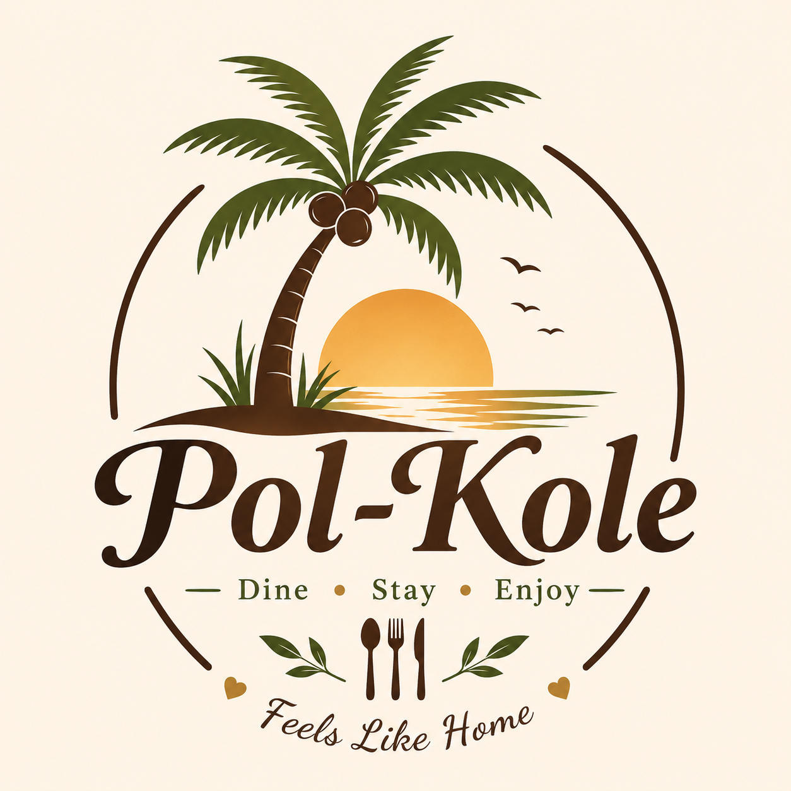
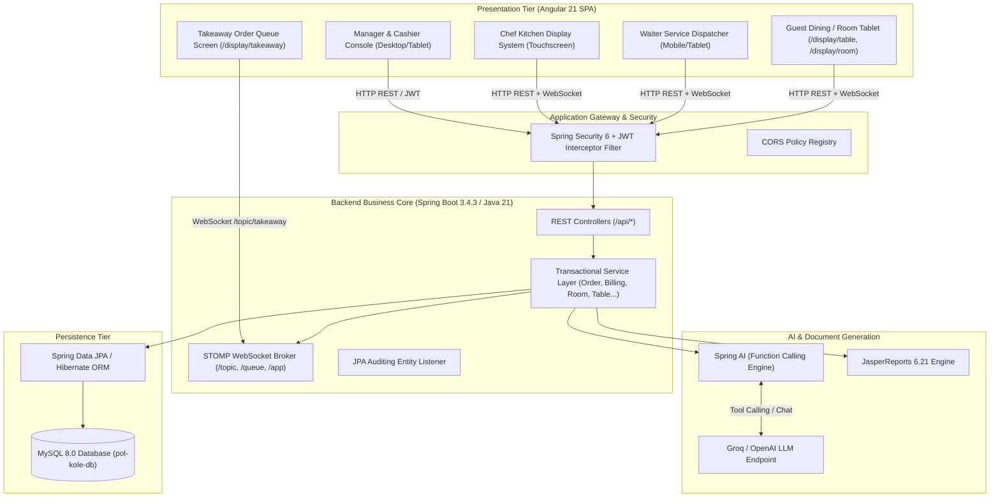

<div align="center">
  
</div>

# Pol Kole Resort & Restaurant Management System 

[](https://github.com/Nugi29/Pol-Kole-RMS)
[](Pol-Kole-Backend/README.md)
[](Pol-Kole-Frontend/README.md)
[](https://adoptium.net/)
[](https://www.mysql.com/)
[](https://spring.io/projects/spring-ai)
[](https://spring.io/guides/gs/messaging-stomp-websocket/)

**Pol-Kole RMS** is a modern, enterprise-grade hospitality software suite designed to unify resort lodging, multi-zone restaurant dining, real-time Kitchen Display Systems (KDS), interactive customer kiosk tablets, public takeaway display screens, omnichannel POS billing, and executive Generative AI business intelligence.

## [](#license)

---

## 🏛️ System Architecture

Pol-Kole RMS is built on a decoupled, multi-tier Object-Oriented Client-Server Architecture. The frontend Single Page Application (SPA) communicates with the Spring Boot backend via stateless REST APIs (JSON) for transactional workflows, and bi-directional WebSockets (STOMP) for sub-second notifications.



### Applied Design Patterns

- **Layered Architecture (Controller-Service-Repository)**: Enforces separation of concerns between HTTP endpoints, transactional business logic, and relational persistence.
- **Data Transfer Object (DTO) Pattern**: Decouples external API payload contracts from database entities, preventing schema leaks and circular serialization.
- **Observer / Publish-Subscribe Pattern**: Implemented via Spring WebSocket Message Broker to push real-time kitchen and service updates instantly to connected clients.
- **Autonomous Tool-Calling Pattern**: Bridges Spring AI with internal domain services via `@Tool` annotations to generate natural language executive business reports.

---

## ✨ Features

### 🍽️ 1.  Dining & Order Management

- Multi-channel ordering engine supporting **Dine-In**, **Room Service**, and **Takeaway**.
- Interactive item modifiers, cooking preferences, allergy notes, and course timing.
- Real-time order state machine: `PENDING` $\rightarrow$ `CONFIRMED` $\rightarrow$ `PREPARING` $\rightarrow$ `READY` $\rightarrow$ `SERVED` $\rightarrow$ `BILLED` $\rightarrow$ `CANCELLED`.

### 👨‍🍳 2. Real-Time Kitchen Display System (KDS)

- Sub-second synchronized ticket queue for kitchen chefs.
- Visual timers, color-coded priority alerts, and station breakdown.
- Real-time state broadcasting over WebSocket `/topic/kitchen`.

### 🛎️ 3. Smart Staff Dispatching & Service Hub

- **Guest Call-Waiter**: Guests tap their table or room tablet to request water, cutlery, or the bill.
- **Targeted Dispatch**: Alerts are routed directly to the waiter assigned to that specific table or room, with automatic duty manager fallback.
- **Table Turnaround Alerting**: Alerts service personnel when a table requires cleaning.

### 🏨 4. Hotel Lodging & Front Desk Operations

- Complete hotel room catalog (Deluxe, Suite, Family, Standard) with live occupancy tracking.
- Room booking, reservation management, check-in, key assignment, and check-out.
- Room service dining orders can be routed directly to the guest's hotel room folio.

### 💳 5. Point-of-Sale (POS) Billing & Vouchers

- Automated tax calculation engine: Configurable VAT and Service Charge rates.
- Time-windowed item promotional discounts, voucher coupon redemption, and loyalty points deductions.
- Thermal POS receipt printing engine (80mm & 58mm) and compiled **JasperReports PDF** invoice generation.

### 📊 6. Executive Business Intelligence & Spring AI Assistant

- Daily Flash and revenue breakdown reports (Gross Sales, Net Sales, Tax, Discounts, Channel Revenues).
- Menu engineering analytics (Top selling dishes, low turnover items, category yield).
- **Autonomous AI Chatbot**: Managers can converse with an AI analyst powered by Spring AI and Groq/OpenAI to answer complex operational questions.
- **One-Click Executive PDF Export**: Synthesizes AI insights and chart metrics into JasperReports executive briefing PDFs.

### 📺 7. Public Displays & Customer Kiosks

- **Takeaway Big Screen (`/display/takeaway`)**: TV display showing order preparation numbers.
- **Guest Table & Room Kiosks (`/display/table/:id`, `/display/room/:id`)**: Digital ordering and service calling without requiring staff credentials.

---

## 💻 Technologies Used

### Backend Stack

- **Language**: Java 21 (LTS)
- **Framework**: Spring Boot 3.4.3
- **Security**: Spring Security 6, JWT (io.jsonwebtoken 0.12.6), BCrypt
- **ORM & Data**: Spring Data JPA, Hibernate ORM, MySQL Connector/J 9.6.0
- **Real-Time Broker**: Spring WebSocket with STOMP protocol
- **Generative AI**: Spring AI 1.0.0-M6 (`spring-ai-openai`) with Groq / OpenAI compatibility
- **Reporting Engine**: JasperReports 6.21.3, OpenPDF 1.3.43
- **API Documentation**: Springdoc OpenAPI Starter WebMVC 2.8.5 (Swagger UI)
- **Utilities**: Project Lombok 1.18.42, ModelMapper 3.2.2, Spring Dotenv 4.0.0

### Frontend Stack

- **Framework**: Angular 21.2.0 (Angular CLI 21.2.1)
- **Language**: TypeScript 5.9.2
- **Styling**: TailwindCSS 4.1.13, PostCSS 8.5.6
- **UI Component Suites**: PrimeNG 21.1.3 (`@primeuix/themes`), Angular Material 21.2.2, PrimeIcons 7.0.0
- **State & Reactivity**: RxJS 7.8.0
- **Testing**: Vitest 4.0.8, JSDOM 28.0.0
- **Code Quality**: Prettier 3.8.1

---

## 📦 Dependencies

| Subsystem    | File                                                               | Primary Dependencies                                                                                 |
| :----------- | :----------------------------------------------------------------- | :--------------------------------------------------------------------------------------------------- |
| **Backend**  | [`Pol-Kole-Backend/pom.xml`](Pol-Kole-Backend/pom.xml)             | `spring-boot-starter-web`, `spring-boot-starter-websocket`, `spring-boot-starter-data-jpa`, `spring-boot-starter-security`, `jjwt-api`, `spring-ai-openai`, `jasperreports`, `mysql-connector-j`, `modelmapper`, `lombok`, `springdoc-openapi-starter-webmvc-ui` |
| **Frontend** | [`Pol-Kole-Frontend/package.json`](Pol-Kole-Frontend/package.json) | `@angular/core`, `@angular/material`, `primeng`, `@primeuix/themes`, `primeicons`, `tailwindcss`, `rxjs`, `vitest` |

---

## 📁 Project Structure

```
Pol-Kole-RMS/
│
├── README.md                          # Root project documentation (this file)
├── OOAD_DESIGN_DOCUMENTATION.md       # Full OOAD specification & diagrams
│
├── Pol-Kole-Backend/                  # Spring Boot 3.4 / Java 21 Backend Service
│   ├── README.md                      # Backend detailed guide & API reference
│   ├── .env                           # Backend environment variables
│   ├── pom.xml                        # Maven dependencies & build definitions
│   ├── mvnw / mvnw.cmd                # Maven wrapper binaries
│   └── src/
│       ├── main/
│       │   ├── java/com/rms/polkole/  # Controllers, Services, Entities, AI Tools
│       │   └── resources/
│       │       ├── application.yml    # Main Spring configuration
│       │       └── reports/           # JasperReports templates (.jrxml)
│       └── test/                      # Backend test suites
│
└── Pol-Kole-Frontend/                 # Angular 21 Single Page Application
    ├── README.md                      # Frontend architecture & component guide
    ├── .env                           # Frontend environment variables
    ├── package.json                   # NPM dependencies and scripts
    ├── angular.json                   # Angular workspace configuration
    ├── scripts/
    │   └── set-env.js                 # Synchronizes .env into environment.ts
    └── src/
        ├── app/                       # 17 Feature modules, services, routing
        ├── environments/              # Development & Production environments
        └── styles.css                 # TailwindCSS design system & global styles
```

---

## 📋 Prerequisites

Before running the system, ensure you have installed:

- **Java Development Kit (JDK)**: Version 21 LTS ([Temurin](https://adoptium.net/) or [Oracle](https://www.oracle.com/java/technologies/downloads/))
- **Node.js**: Version 20.x or 22.x LTS ([NodeJS.org](https://nodejs.org/))
- **npm**: Version 10.x or higher (bundled with Node.js)
- **MySQL Database Server**: Version 8.0 or higher
- **Groq API Key / OpenAI API Key**: For Spring AI autonomous reporting features ([Groq Console](https://console.groq.com/))

---

## 🚀 Installation & Setup

### 1. Clone the Entire Monorepo

```bash
git clone https://github.com/Nugi29/Pol-Kole-RMS.git
cd Pol-Kole-RMS
```

### 2. Configure the MySQL Database

Log in to your MySQL terminal or GUI (e.g. MySQL Workbench / DBeaver) and create the database:

```sql
CREATE DATABASE `pol-kole-db`
```

### 3. Setup Backend Environment

Navigate into `Pol-Kole-Backend` and inspect the `.env` file:

```bash
cd Pol-Kole-Backend
# Edit .env with your MySQL credentials and Groq API key:
# DB_USERNAME=root
# DB_PASSWORD=your_mysql_password
# GROQ_API_KEY=your_groq_api_key
```

Build the backend project:

```bash
# Windows
.\mvnw.cmd clean install -DskipTests

# Linux / macOS
chmod +x mvnw
./mvnw clean install -DskipTests
```

### 4. Setup Frontend Environment

Open a new terminal window, navigate to `Pol-Kole-Frontend`, install packages, and synchronize environment variables:

```bash
cd Pol-Kole-Frontend
npm install
npm run config
```

---

## 🏃 Running the Project

To run the complete Pol-Kole RMS ecosystem locally:

### Step 1: Start the Backend Service

In your backend terminal (`Pol-Kole-Backend`):

```bash
# Windows
.\mvnw.cmd spring-boot:run

# Linux / macOS
./mvnw spring-boot:run
```

> The backend will start on **`http://localhost:8080`**.

### Step 2: Start the Frontend Application

In your frontend terminal (`Pol-Kole-Frontend`):

```bash
npm start
```

> The Angular app will be served on **`http://localhost:4200`**.

### Step 3: Access the Applications

- **Management Portal & Login**: [`http://localhost:4200/login`](http://localhost:4200/login)
- **Public Takeaway TV Screen**: [`http://localhost:4200/display/takeaway`](http://localhost:4200/display/takeaway)
- **Table Guest Tablet**: [`http://localhost:4200/display/table/1`](http://localhost:4200/display/table/1)
- **Hotel Room Tablet**: [`http://localhost:4200/display/room/101`](http://localhost:4200/display/room/101)
- **Swagger Interactive API Docs**: [`http://localhost:8080/swagger-ui/index.html`](http://localhost:8080/swagger-ui/index.html)
- **OpenAPI Schema (JSON)**: [`http://localhost:8080/v3/api-docs`](http://localhost:8080/v3/api-docs)

---

## 🔗 Subsystem Quick Links

For comprehensive, in-depth architectural and developer documentation, refer to the individual subsystem guides:

- 📘 [**Backend Service Documentation**](Pol-Kole-Backend/README.md): Detailed API endpoint catalogs, database schema details, STOMP WebSocket topics, Spring AI tool definitions, and security policies.
- 📙 [**Frontend Application Documentation**](Pol-Kole-Frontend/README.md): UI component breakdown, route table, role-based navigation, thermal receipt printer service, and state management.
- 📐 [**OOAD Design Specification Document**](OOAD_DESIGN_DOCUMENTATION.md): Formal Object-Oriented Analysis & Design specifications, Use Case models, Domain Class diagrams, and Sequence flows.

---

## 🔮 Future Improvements

- [ ] **Mobile Native Apps**: Develop React Native or Flutter apps for waitstaff handheld terminals and guest concierge.
- [ ] **Payment Gateway Webhooks**: Automatic reconciliation via Stripe, PayHere, and commercial banks' LankaQR webhooks.
- [ ] **Offline PWA Support**: ServiceWorker caching for uninterrupted ordering during network disruptions.
- [ ] **Multi-Property Chain Management**: Support centralized group accounts managing multiple resorts and restaurant branches.
- [ ] **Smart Inventory & Wastage Forecasting**: Predictive AI models forecasting food ingredient consumption based on historical occupancy.

---

## 👨‍💻 Author

**Nugi29**

- GitHub: [@Nugi29](https://github.com/Nugi29)
- Repository: [Pol-Kole-RMS](https://github.com/Nugi29/Pol-Kole-RMS)
- Email: [nugitha.c@gmail.com](mailto:nugithadc@gmail.com)

---

## 📄 License

This project is developed as part of the Pol-Kole Hospitality Software Initiative. All rights reserved. Please refer to repository licensing terms for commercial usage inquiries.